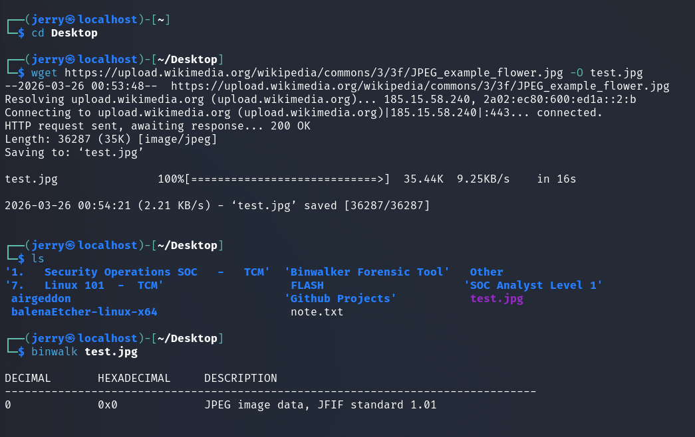

# 🔍 Binwalk Forensics Lab

A hands-on cybersecurity project focused on analyzing suspicious files, detecting hidden data, and performing digital forensics using **Binwalk** and manual analysis techniques.

---

## 📌 Overview

This project demonstrates how attackers can hide data inside normal files and how a cybersecurity analyst can detect, extract, and analyze that hidden content.

It is designed to simulate real-world **SOC (Security Operations Center)** and **digital forensics** scenarios.

---

## 🎯 Objectives

- Analyze suspicious files using Binwalk  
- Detect hidden or embedded data  
- Extract concealed payloads  
- Perform manual analysis (strings, hexdump, dd)  
- Understand real-world forensic investigation workflow  
- Document findings in a professional format  

---

## 🛠 Tools Used

- **Binwalk** – File analysis and extraction  
- **strings** – Extract readable text  
- **hexdump** – View raw binary data  
- **dd** – Extract specific file sections  
- **file** – Identify file types  

---

## ⚙️ Project Workflow

### 1. File Analysis
- Scan files using Binwalk  
- Identify embedded data and file signatures  

### 2. Hidden Data Detection
- Detect hidden files inside images or binaries  
- Analyze suspicious file structures  

### 3. Data Extraction
- Extract embedded content using:
  ```bash
  binwalk -e file
  binwalk -Me file
  ```
### 4. Manual Analysis

Inspect file content using:
```bash
strings file
hexdump -C file
```
### 5. Targeted Investigation
- Extract specific data using offsets:
```bash
dd if=file bs=1 skip=<offset> count=<size>
```
### 6. Reporting
- Document findings
- Explain risks and impact

---

## 🔍 Key Concepts
- Hidden Data (Embedded Files)
- File Signatures
- Entropy (Randomness Detection)
- Recursive Extraction
- Manual Forensic Analysis

---

## 🚨 Real-World Application

This project reflects real-world cybersecurity tasks such as:
- Malware analysis
- Incident response
- Digital forensics
- Threat investigation
- Suspicious file analysis

---

## 🧠 Skills Gained
- File analysis and investigation
- Identifying hidden threats
- Practical use of forensic tools
- Analytical thinking in cybersecurity
- Writing professional security reports



---

## 📝 Example Finding
A normal image file was found to contain a hidden ZIP archive.
The archive included sensitive data that was not visible during normal use.

This demonstrates how attackers can hide information inside trusted file formats.

---

## 💡 Key Takeaway
- Not all files are what they appear to be.
- Always analyze beyond the surface.

## 📎 Author
*Mudrik Mohamed | SOC Analyst in Training*
